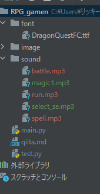
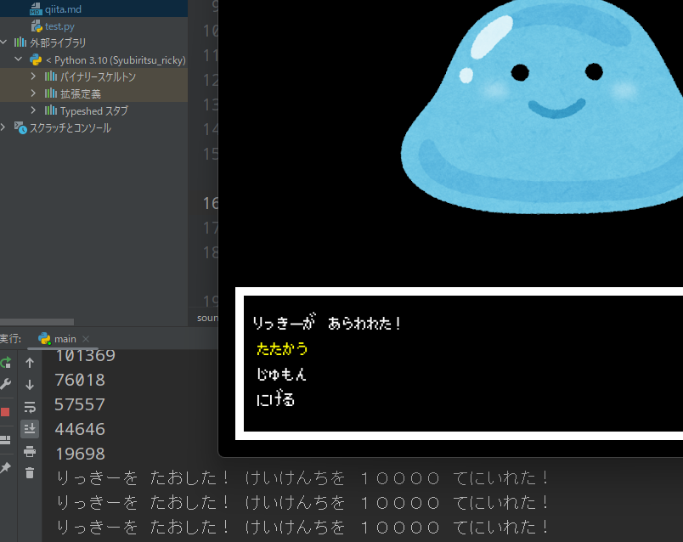

この記事は、岩手県八幡平市のプログラミング教室「アクセルキャンプ」の公開教材です。
[アクセルキャンプ(フリースペースプラウド)のリンク](https://freespaceproud.com)
教材の作成依頼等も承っております。ご意見等は、リンク先の問い合わせ欄からお願いします。
教材の転用・利用等は自由です  
***

# 寒い！起きれない！ﾈﾑｲ(´･ωゞ)
布団から出られません。先生、最近朝4時起きしてるんですが、外は氷点下です。起きねぇっすマジムリっす。 アルバイトを募集します。朝4時に先生の家まで来て先生を起こすだけの簡単なお仕事です。応募はフリースペースプラウドまで。  
  
# 前回までのコード  
```python
import pygame
from pygame.locals import *
import sys

# 効果音を再生する関数
def sound_effect(sound):
    pygame.mixer.music.load(sound)
    pygame.mixer.music.play(1)


    /*中略*/
    # 効果音
    select_sound = "sound/select_sound.mp3"

    while (1):
        /*中略*/
        # イベント処理
        for event in pygame.event.get():
            if event.type == QUIT:  # 閉じるボタンが押されたら終了
                pygame.quit()  # Pygameの終了(画面閉じられる)
                sys.exit()

            elif event.type == KEYDOWN:
                if event.key == K_UP:
                    if action_number == 0:
                        action_number = 2
                    else:
                        action_number -= 1
                     
                    # 再生
                    sound_effect(select_sound)
                elif event.key == K_DOWN:
                    if action_number == 2:
                        action_number = 0
                    else:
                        action_number += 1
                    # 再生
                    sound_effect(select_sound)


if __name__ == "__main__":
    main()

```

前回はsound_effect関数を作成し、選択肢を変えるたびに音を鳴らしていましたね。

# サーセン(๑´ڤ`๑)ﾃﾍ♡
前回の記事で、間違いがありました。「え？うまく動いてんじゃん」って思うかもしれませんが、結構大きな間違い💦

前回は音楽ファイルを「BGMとして」再生していました。本来は「効果音として」再生したいです。sound_se関数を、以下のように修正してください
```python
"""修正前
def sound_effect(sound):
    pygame.mixer.music.load(sound)
    pygame.mixer.music.play(1)
    time.sleep(0.2)
    pygame.mixer.music.stop()
"""

# 修正後
def sound_effect(sound):
    se = pygame.mixer.Sound(sound)
    se.play()

```

time.sleep()で、わざわざプログラムを0.2秒止めて音楽を再生していたんですね。選択音のような短いファイルならなんとかごまかせそうですが、少し長めのファイルになると、問題が出てきます。pygame.mixer.Sound()をつかうことで、効果音として、プログラムを止めることなく再生できます。

# 選択肢によって効果音を変えよう
「たたかう」「じゅもん」「にげる」選択肢を選んでいる状態でエンターキーを押すと、それに合った効果音が再生される、というのを実装していきます。  
  
まず、音楽ファイルを用意しましょう。今回は[効果音ラボ](https://soundeffect-lab.info/)のサイトから音源を持ってきます。  
- たたかう：https://soundeffect-lab.info/sound/battle/mp3/sword-slash1.mp3
- じゅもん：https://soundeffect-lab.info/sound/battle/mp3/magic-statusup2.mp3
- にげる：https://soundeffect-lab.info/sound/anime/mp3/flee1.mp3  

ダウンロードできたら、それぞれのファイルをsoundフォルダに移します。



それでは、コードでそれぞれの音がなるようにしていきましょう。  
  
「エンターキーを押すと」音が鳴る、というようにしたいので、event.type == KEYDOWNのあたりをいじっていけばよさそうですね。前回も「↓」を押したときに音が鳴る、としたので、それをマネしてみましょう。
  
```python
elif event.type == KEYDOWN:
    if event.key == K_DOWN:
        if action_number == 2:
            action_number = 0
        else:
            action_number += 1
        sound_effect("sound/select_se.mp3")
    elif event.key == K_RETUREN:
        sound_effect("sound/battle.mp3")

```  
音は再生されましたか？うまくいってないときは、エラー文をよく見た上で、ファイルのパス（sound/spell.mp3）のスペルなどを確認してみてください。  
現在はどこでもエンターキーを押すと攻撃用bgmが流れてきてしまうので、これを条件分岐を使ってじゅもん、にげるでも音が出るように改良しましょう。条件分岐わすれちゃったぜ！という人は、[ここ](https://qiita.com/ricky-sensei/items/6dfb02324b62c313498a)で再確認してみてください
  
```python
elif event.type == KEYDOWN:
    if event.key == K_DOWN:
        if action_number == 2:
            action_number = 0
            
        else:
            action_number += 1
        sound_effect("sound/select_se.mp3")
        
    elif event.key == K_RETUREN:
        
        # たたかう
        if action_number == 0:
            sound_effect("sound/battle.mp3")
            
        # じゅもん
        elif action_number == 1:
            sound_effect("sound/spell.mp3")
            
        # にげる
        elif action_number == 2:
            sound_effect("sound/run.mp3")
    

```  

# HP機能の実装

今の状態では、ただスライムに攻撃したら、攻撃の音がするだけ担っているので、実際にHPを減らすことができるようにしましょう。  
  
以下のように要件定義をします。

>①スライムの体力は530,000
> ②攻撃の威力は10.000から30,000までのランダムな数字
> ③HPがゼロになったら、「”リッキーを たおした！ けいけんちを １００ てにいれた”」と表示  

### ①スライムの体力は530,000  
〇リーザ様ですね。これは最初から決まっている値なので、メインループが始まる前に変数を作りましょう
```python
hit_point == 530000
```  
  
### ②攻撃の威力は10.000から30,000までのランダムな数字  
pythonでランダムな数字を得るためにはいくつかの手段があります。python自体にはランダム機能は含まれているのですが、デフォルトの状態ではその機能を使えるようになっていません。なので、pygame同様に,「random」をimportする必要があります。
今回は小数ではなく整数のランダムな値にしたいので、randomモジュールのなかのrandint()関数を使います。引数として、ランダムの範囲（〇から×までのランダムな整数の場合、〇と×）の２つの整数を引数に取ります。


```python
import random
"""
中略
"""
attack = random.randint(10000, 30000)
```
attackですが、どこに書いたいいかわかりますか？キーボードのボタンが押されたとき → そのキーがエンターキーだったとき → 「たたかう」が選択されていた時（action_numberが0だったとき） に、攻撃をしたいわけですので、しかるべきところに書いていきましょう。 ついでに、Hit_Pointからattackを引き算しちゃいましょう。

```python
elif event.type == KEYDOWN:
    if event.key == K_DOWN:
        if action_number == 2:
            action_number = 0
        else:
            action_number += 1
        sound_effect("sound/select_se.mp3")

    # エンターキーが押されたとき
    elif event.key == K_RETURN:
        # 「たたかう」のBGM
        if action_number == 0:
            sound_effect("sound/battle.mp3")
            
            #10000から30000までのランダムな整数 
            attack = random.randint(10000, 30000)
            hit_Point -= attack
```

### ③HPがゼロになったら、「”リッキーを たおした！ けいけんちを １００ てにいれた”」と表示  
ここまで来れたらもう簡単。if文で残りHPを判定して、printするだけですね。
```python
if action_number == 0:
    sound_effect("sound/battle.mp3")
    attack = random.randint(10000, 30000)
    hit_point -= attack
    if hit_point <= 0:
        print("りっきーを たおした！ けいけんちを １００００ てにいれた！")
    else:
        print(hit_point)
```
  
コード全体を見てみましょう。  

 
現在はログが出ているだけなので、次回はこれをしっかり画面に反映させていきましょう。

***
今回はここまで！来週の内容ですが、実は今までの内容の応用のみで実装可能です。  四角を表示して、ＨＰの表示をしますが、ポイントはどういうときに四角を表示して、どういうときに非表示にするかです。
ぜひ、前の記事を確認しながら、挑戦してみてください！
