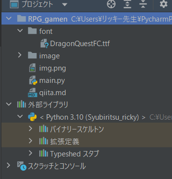
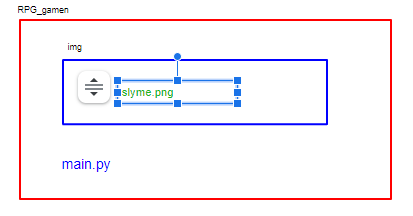
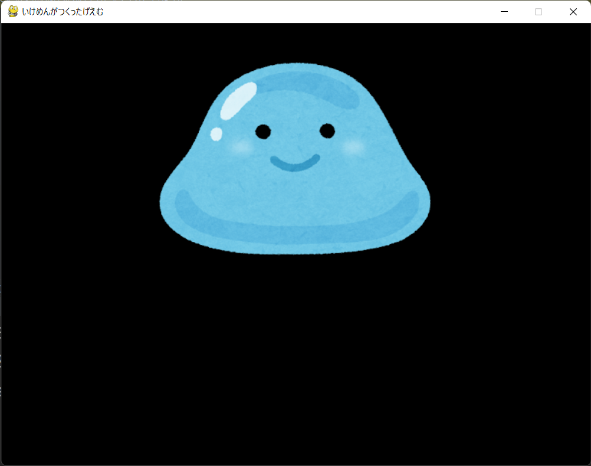
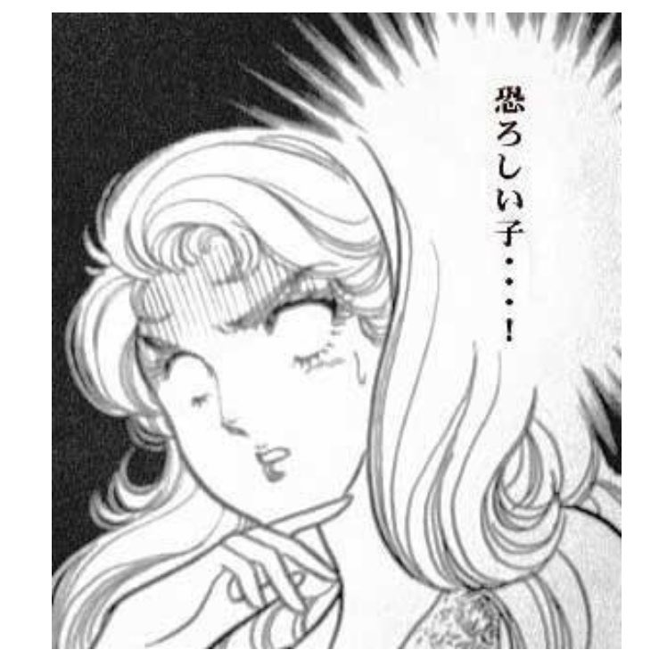

# 寒くなってきたぜ！　　
風邪ひかないようにね！先生は天才なので、いつ風邪をひくかいつもひやひやしています。それに加えてイケメンなので、気が気じゃありません。　　

# PygameでRPG風な画面を作ってみよう。  
今の君たちに言っても全然伝わらない可能性があるけど、先生の時代はファミコンからスーパーファミコンに切り替わったり、初代プレイステーションがでて、「すげー！ＣＧやべえ！！ゲームすげー！！！」てなった時代です。中学生になってＦＦ１０が出たときなんかもう、グラフィックがきれいすぎてぶったまげたもんです。今のゲームと比べると全然ですが、なんていうか、そういう感動が今のゲームにはない気がします。　　

今日みんなに作ってもらいたいのは、こういう感じの、いわゆる「ドット絵」風な、１９８０年代くらいのゲーム「風な」画面です。
　　
これに、今後動きを付けたり、戦闘の描写を付けたりしていきます。　　


「なにこれ、だっさ」とか言ったそこの君！廊下に立ってなさい！！ドット絵のすばらしさについて３時間お説教の刑です！　　
冗談ですが。やっていくうちに「ドット絵のゲームでさえこんなだから、実際のゲーム作ってる人ってすごいんだなぁ」みたいな感覚はもってほしいです.   
  
# ①まずは呪文から
pygame初期状態の呪いの呪文を唱えましょ
```python
import pygame
from pygame.locals import *
import sys

def main():
    pygame.init()                                   # Pygameの初期化
    screen = pygame.display.set_mode((400, 300))    # 400 x 300の大きさの画面を作る
    pygame.display.set_caption("クソゲー")              # 画面上部に表示するタイトルを設定

    while (1):
        screen.fill((0,0,0))        # 画面を黒色に塗りつぶし
        pygame.display.update()     # 画面を更新
        # イベント処理
        for event in pygame.event.get():
            if event.type == QUIT:  # 閉じるボタンが押されたら終了
                pygame.quit()       # Pygameの終了(画面閉じられる)
                sys.exit()


if __name__ == "__main__":
    main()
```
これ、いちいちうつの超めんどいですよね？  
こういうとき、いつも授業で使ってるpycharmでは、ライブテンプレートという機能が使えます。
詳しくは[ここ](https://y0m0r.hateblo.jp/entry/20130822/1377180840)とかを見るといいと思いますが、pycharmと入力しただけで、この初期状態のコードがまるっと出てくるわけです。  
  
ではまず、スライムくんの画像を表示しましょう。  
ここで、pythonプロジェクトのディレクトリについて、話しておく必要があります。
  
pycharmの左側を見てみましょう。こんなのが表示されています。


ここには、作成したプロジェクトの中にどんなパーツが入っているかが書いてあります。 
ゲームを作るには、ソースコードだけではできませんよね。スライムや勇者の画像、音楽などのパーツをおいておき、それらを使いたいときに使えるように、整理しておいておくのがいいですね。例えば、画像のファイルが音楽のファイルと一緒になっていたら、それをソースコードから使いたいときに、ちょっと面倒ですよね。  
  
ソースコードは、ゲームを作るのに必要なパーツの一つでしかありません。一般的に「フォルダ」と言われるものが、プログラミング的には「ディレクトリ」と呼ばれたりします。  
では、プロジェクトディレクトリ（一番大きいでディレクトリ）の下にimgディレクトリを作って、その中にスライムの画像を入れてみましょう。画像のファイル名は「slyme.png」という名前にしましょう。すると、こんな感じの後世になります。


ここで、main.pyの気持ちになって、slyme.pngを探してみてください。
main.pyさんの住んでいる部屋には、imgという小部屋があります。そのなかに、slyme.pngさんがいます。すると、  
「imgの部屋のなかのslyme.pngさん」という風に指定すると、会いたい人（ほしいデータ）に出会えそうですね。そのことを意識したうえで、次のコードを、メインループの前に追加してみましょう。

```python
import pygame
from pygame.locals import *
import sys

def main():
    pygame.init()                                   # Pygameの初期化
    screen = pygame.display.set_mode((800,600))    # 400 x 300の大きさの画面を作る
    pygame.display.set_caption("いけめんがつくったげえむ")              # 画面上部に表示するタイトルを設定
    
    #追加部分
    slyme_image = pygame.image.load("image/slyme.png")
    # 以下省略
```
slyme.pngという画像ファイルの情報を、slyme_imageという変数に入れます。loadって、ゲームで見たことないですかね？「now loading(ロード中)」とかってやつです。load=読み込み 的な意味です。これで画像をいつでも使える準備ができました。
  
ここの、"image/slyme.png"というところに注目です。ここの / は、「～ディレクトリのなかの～」というのを表しています。たとえば "A / B / C" となると、「AディレクトリのなかのBディレクトリの中のC」となります。

では、この画像を表示してみましょう。
画像などのデータを表示するには。次のメソッドを使います。
```python
screen.blit(表示したい画像,(表示したい座標))
```
ここでちょっと気をつけなくちゃいけないのが、表示したい座標についてです。ここでは、画像の中心ではなく、左上をこの座標に合わせることになるので、狙った場所に画像を出すには、その画像の縦幅・横幅の半分だけずらして表示する必要があります。このsylme.pngはたて・よこともに４００のサイズになっていますので、どまんなかやや上に表示してRPGっぽく表示するには、こんな感じになります。
```python
screen.blit(slyme_image, (400-(400 / 2), 0))
```
これを、メインループ内に追加します。  
※ちなみに、画像の縦横の長さを取得する方法もあるのですが、ややこしくなってしまうのでここでは省略します。


では、画面下部に文字を表示するための枠線を描画しましょう。  
長方形の枠線を描画するには、以下の関数を使います。
```python
pygame.draw.rect(screen,(255, 255, 255),Rect(20, 400, 760, 180), 10)
```
255が三つ並んでる時点で、「お！これ絶対RGBじゃん！白い枠線じゃん！」みたいになった人は、ちゃんと勉強してますね！恐ろしい子！


pygameのdraw.rectは、４つの引数を取ります。
①どの画面に出力するか
②枠線の色（RGB）
③Rect型で四角の範囲を指定
④枠線の太さ  
  
③が一番イミフだと思います。コードに書かれている  
> Rect(20, 400, 760, 180)
  
を見てみましょう。最初の２つの数字は、四角の左上のx座標、ｙ座標です。３つ目の７６０は、左上の頂点からの横の長さ、最後の１８０は縦の長さです。左上をの点をきめて、そこからどれくらいの長さをカバーすることを決めて、長方形の範囲を決めているんですね。


